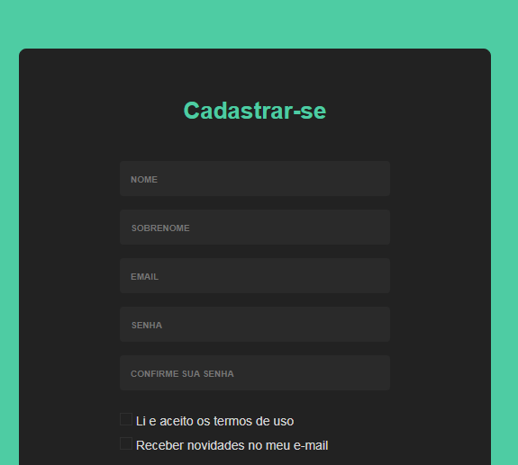

## Login Form

    Simple login form page, using only HTML, CSS in your construction. 

    It's quite simple, but this little project begins my long personal journey of learning in the 
    world of web development!

You can acess the site clicking [***here***](https://tas48.github.io/Login-form/) and there you'll see it.

## Images of the project's 

    
  

    
  

    
  

